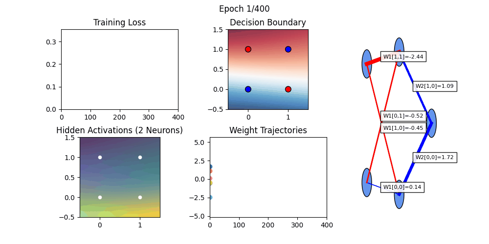

## Algorithms

This section provides an overview of essential Machine Learning algorithms that every data scientist should know. These algorithms are broadly categorized into **Supervised**, **Unsupervised**, **Semi-Supervised**, **Reinforcement Learning**, and **Neural Networks**.

---

### 🔹 Supervised Learning

Supervised learning uses labeled datasets to train models. It is further divided into **Classification** and **Regression** tasks.

#### Classification
- Naïve Bayes – Probabilistic classifier based on Bayes’ theorem.  
- Logistic Regression – Models the probability of categorical outcomes.  
- K-Nearest Neighbor (KNN) – Instance-based learning method using similarity measures.  
- Random Forest – Ensemble of decision trees for improved accuracy and robustness.  
- Support Vector Machine (SVM) – Finds the optimal hyperplane for classification tasks.  
- Decision Tree – Tree-structured model for decision-making and prediction.  

#### Regression
- Simple Linear Regression – Predicts outcomes using a single independent variable.  
- Multivariate Regression – Handles multiple predictors for continuous outputs.  
- Lasso Regression – Linear regression with L1 regularization for feature selection.  

---

### 🔹 Unsupervised Learning

Unsupervised learning works with unlabeled datasets to discover hidden patterns.

#### Clustering
- K-Means Clustering – Partitions data into K clusters using centroids.  
- DBSCAN Algorithm – Density-based clustering for arbitrary-shaped clusters.  

#### Dimensionality Reduction
- Principal Component Analysis (PCA) – Transforms features into principal components.  
- Independent Component Analysis (ICA) – Separates a multivariate signal into independent components.  

#### Association
- Frequent Pattern Growth (FP-Growth) – Efficient algorithm for frequent itemset mining.  
- Apriori Algorithm – Classic association rule learning for market basket analysis.  

#### Anomaly Detection
- Z-score Algorithm – Detects outliers based on statistical deviation.  
- Isolation Forest Algorithm – Identifies anomalies using random partitioning.  

---

### 🔹 Semi-Supervised Learning

Semi-supervised learning uses both labeled and unlabeled data.

#### Classification
- Self-Training – Iteratively labels and retrains using high-confidence predictions.  

#### Regression
- Co-Training – Uses multiple learners to iteratively label unlabeled data.  

---

### 🔹 Reinforcement Learning

Reinforcement learning trains agents through **trial and error** by interacting with the environment.

#### Model-Free Methods
- Policy Optimization – Learns optimal policies directly.  
- Q-Learning – Value-based method to find the best action.  

#### Model-Based Methods
- Learn the Model – Builds an environment model for planning.  
- Given the Model – Uses a pre-defined environment model for decision-making.  

---

### 🔹 Neural Networks (NN)

Neural Networks learn complex nonlinear relationships using layers of interconnected neurons.

#### Fundamental Architectures
- **Perceptron** – The simplest neural model; foundation of modern NNs.  
- **Multi-Layer Perceptron (MLP)** – Fully connected feedforward network (e.g., XOR model).  
- **Convolutional Neural Network (CNN)** – Specializes in image and spatial data.  
- **Recurrent Neural Network (RNN)** – Handles sequential or time-dependent data.  
- **Long Short-Term Memory (LSTM)** – Solves long-term dependency problems in sequences.  
- **Transformer Models** – Attention-based architecture powering modern NLP and vision models.

#### Training Concepts
- **Forward Propagation** – Computes predictions layer by layer.  
- **Backpropagation** – Calculates gradients to update weights.  
- **Activation Functions** – Sigmoid, ReLU, Tanh, Softmax, etc.  
- **Loss Functions** – MSE, Cross-Entropy, MAE.  
- **Optimization Algorithms** – SGD, Adam, RMSProp.

#### Example  
The included GIF (`xor_full_combined.gif`) demonstrates how a small MLP learns the XOR function, visualizing:  
- Decision boundary evolution  
- Hidden layer activations  
- Weight trajectories  

---

## Reference Materials

* [Machine Learning](/Books/Machine%20Learning.pdf)  
* [Reinforcement Learning](/Books/Reinforcement%20Learning%20An%20Introduction.pdf)  
* [Deep Learning](/Books/d2l-en.pdf)  
* [Numerical Python: Scientific Computing and Data Science Applications with Numpy, SciPy, and Matplotlib](/Books/Numerical%20Python%20Scientific%20Computing%20and%20Data%20Science%20Applications%20with%20Numpy%20SciPy%20and%20Matplotlib.pdf)
